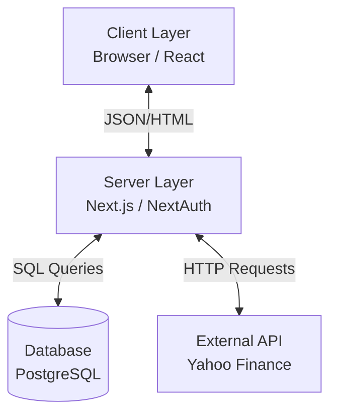
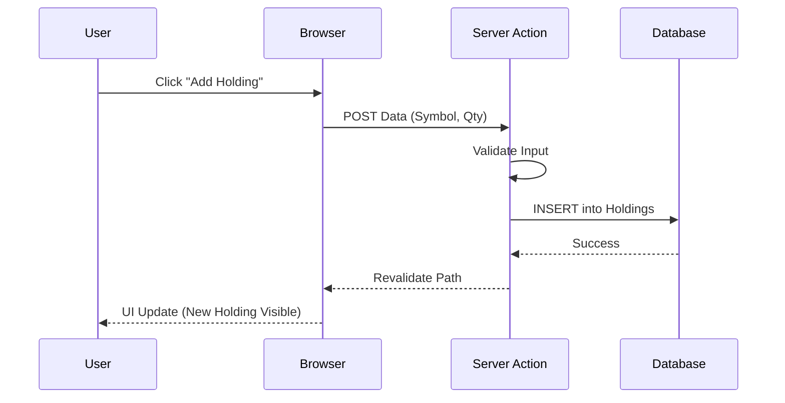
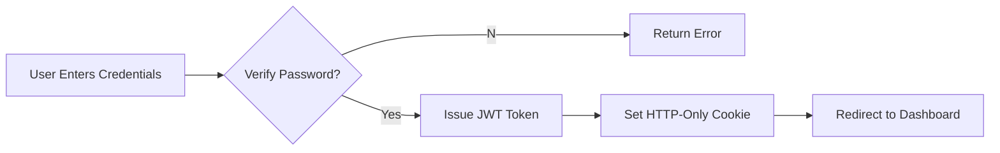

# Project Title: StockMetric - NSE Portfolio Tracker
**Author:** Gaurav-99 (GitHub Identifier)
**Date:** December 24, 2025

---

## 1. Project Overview

**StockMetric** is a comprehensive stock tracking and portfolio management application capable of real-time monitoring of Indian NSE (National Stock Exchange) equities. The application is designed to solve the problem of fragmented financial data by providing a unified dashboard where investors can manage their personal holdings, view live market news, and analyze stock performance through interactive charts.

**Target Users:**
*   **Retail Investors:** Individuals managing personal portfolios who need a consolidated view of their assets.
*   **Traders:** Users requiring quick access to real-time price changes and market news.
*   **Market Enthusiasts:** People tracking the broader Indian economy and market trends.

**Key Use Cases:**
*   A user logs in to view the current total value of their portfolio.
*   A user searches for "RELIANCE" to check its live price and historical performance chart.
*   A user reads the latest aggregated headlines regarding the Indian economy.

---

## 2. System Architecture Overview

The system follows a modern **Server-Side Rendering (SSR)** architecture leveraging the Next.js framework, which unifies the frontend and backend into a single cohesive application.

*   **Frontend (Client Layer):** Built with React.js and Tailwind CSS. It handles user interactions, displays dynamic charts using Recharts, and manages client-side state for pagination and forms.
*   **Backend (Server Layer):** Utilizes Next.js Server Components and Server Actions. This layer helps securely connect to the database and external APIs without exposing sensitive keys to the client.
*   **Database Layer:** A PostgreSQL relational database managed via Prisma ORM. It stores user profiles, authentication credentials, and portfolio holdings.
*   **External Services Integration:** The system acts as a gateway to external financial data providers (Yahoo Finance) to fetch live stock quotes and news.

---

## 3. Technology Stack

### Frontend Technologies
*   **Framework:** Next.js 15+ (App Router structure)
*   **Language:** TypeScript (for type safety and maintainability)
*   **Styling:** Tailwind CSS v4 (Utility-first CSS framework)
*   **Visualization:** Recharts (Composable charting library)
*   **Icons:** Lucide React

### Backend Technologies
*   **Runtime:** Node.js
*   **Framework:** Next.js Server Actions (RPC-style backend functions)
*   **ORM:** Prisma (Object-Relational Mapping for type-safe database queries)
*   **Authentication:** NextAuth.js (Secure authentication middleware)

### Database
*   **System:** PostgreSQL
*   **Hosting:** Compatible with any standard Postgres provider (e.g., Supabase, Neon, or local Docker)

### External APIs
*   **yahoo-finance2:** A robust library wrapper for fetching live market data and news.

---

## 4. Data Flow Architecture (Backend ↔ Frontend)

The application relies heavily on **Server Actions** to bridge the gap between the UI and the data layer, ensuring type safety and security.

**General Data Flow:**
1.  **Request:** The user performs an action (e.g., "Add Holding") on the Client Component.
2.  **Server Action:** The browser invokes a remote asynchronous function defined on the server (`addHolding`).
3.  **Validation:** The server validates the input (e.g., positive quantity, valid ticker symbol).
4.  **Database Interaction:** Prisma ORM executes a SQL `INSERT` command to the PostgreSQL database.
5.  **Response/Revalidation:** The server returns the updated data object. Next.js automatically revalidates the cache, causing the UI to update instantly without a full page reload.

**Example: Fetching Stock Details**
1.  **Navigation:** User navigates to `/stocks/INFY`.
2.  **Server Component Render:** The page component (`page.tsx`) runs on the server.
3.  **Parallel Fetching:** content is fetched concurrently:
    *   `getStockHistory('INFY')` calls Yahoo Finance API.
    *   `getStockNews('INFY')` calls Yahoo Finance Search API.
4.  **HTML Generation:** The server constructs the HTML with the fetched data and streams it to the browser.
5.  **Hydration:** React "hydrates" the interactive parts (charts, buttons) on the client side.

---

## 5. Authentication & Authorization Flow

The application secures user data using **NextAuth.js** with a Credentials provider.

**Authentication Method:**
*   **Credentials:** Users sign up with an email and password.
*   **Hashing:** Passwords are hashed using `bcrypt` before storage to ensure security.
*   **Session Management:** Upon successful login, a secure HTTP-only session cookie (JWT - JSON Web Token) is issued to the client.

**Flow:**
1.  User enters credentials on `/login`.
2.  NextAuth verifies the email exists and the password hash matches using `bcrypt.compare()`.
3.  If valid, a JWT is signed and set as a cookie.
4.  Middleware (`middleware.ts`) checks this token on every protected route request (e.g., `/dashboard`). If missing or invalid, the user is redirected to the login page.

---

## 6. Feature Breakdown

### A. Live Portfolio Tracker
*   **Purpose:** To calculate and display the user's net worth based on real-time stock prices.
*   **Logic:** Fetches the user's holdings from the DB and iterates through them to fetch the live price for each symbol.
*   **Math:** `Total Value = Sum(Holding Quantity * Live Price)`.

### B. Stock Search & Analysis
*   **Purpose:** Detailed insight into specific equities.
*   **Frontend:** Displays a line chart of price history (1 Month) and key statistics (P/E ratio, Market Cap).
*   **Backend:** `getStockHistory` service normalizes API responses, converting raw timestamps into readable dates.

### C. Aggregated Market News
*   **Purpose:** Keeping users informed.
*   **Logic:** The system executes parallel queries for "Nifty", "Sensex", "Economy" to gather a broad dataset of ~50 articles.
*   **Design:** A client-side `NewsFeed` component maps these articles into a paginated list (10 articles per page) to improve performance and readability.

---

## 7. Database Design

The database schema is normalized and relational.

**1. User Table** `(User)`
*   `id`: Primary Key (CUID)
*   `email`: Unique index
*   `password`: Hashed string
*   `riskProfile`: Enum (CONSERVATIVE, MODERATE, AGGRESSIVE)

**2. Holding Table** `(Holding)`
*   `id`: Primary Key (CUID)
*   `userId`: Foreign Key linking to `User`
*   `symbol`: Stock Ticker (e.g., "TCS")
*   `quantity`: Integer
*   `averageBuyPrice`: Float
*   **Relationship:** One User has Many Holdings (1:N).

---

## 8. Error Handling & Edge Cases

The application implements defensive programming strategies:
*   **API Limits/Upstream Failures:** If Yahoo Finance API fails or rates limit the request, the services catch the error and return `null` or an empty array. The UI falls back to showing a "Data unavailable" state rather than crashing.
*   **Input Validation:** Forms check for negative numbers or empty fields before submission.
*   **Authentication Errors:** NextAuth handles invalid credentials gracefully, returning specific error codes that the UI displays as user-friendly messages ("Invalid email or password").

---

## 9. Performance & Optimization

*   **Server-Side Rendering (SSR):** Critical pages (Dashboard, Stock Detail) are rendered on the server, significantly reducing First Contentful Paint (FCP).
*   **Parallel Data Fetching:** `Promise.all()` is used heavily in `newsService` and `stockService` to fetch independent data streams (market news, specific stock news, price history) concurrently rather than sequentially.
*   **Asset Optimization:** Next.js `Image` component and font optimization are used to minimize Cumulative Layout Shift (CLS).

---

## 10. Security Considerations

*   **Database Security:** All database access is parameterized via Prisma Client, preventing SQL Injection attacks.
*   **Password Security:** Passwords are never stored in plain text; `bcrypt` adds a salt and hashes them.
*   **Route Protection:** Middleware acts as a gatekeeper, inspecting the session token before allowing access to `/dashboard/*` routes.

---

## 11. Current Limitations

*   **API Rate Limits:** Relying on the public Yahoo Finance endpoint means there are implicit rate limits. Heavy usage could result in temporary data fetching pauses.
*   **Market Data Delay:** Unofficial APIs often have a 15-minute delay compared to professional paid feeds.

---

## 12. Future Enhancements

*   **Multi-Asset Support:** Extending the data model to support Mutual Funds and US Equities.
*   **Email Alerts:** Integrating an SMTP service (like SendGrid) to notify users when a stock hits a target price.
*   **Advanced Charting:** Adding "Candlestick" views and technical indicators (RSI, MACD) to the existing Recharts implementation.

---

## 13. Conclusion

StockMetric successfully implements a full-stack financial application by effectively combining type-safe backend operations with a reactive frontend. The architecture prioritizes data accuracy and user experience, handling complex asynchronous data flows from external markets while maintaining a responsive and secure environment for user data.
